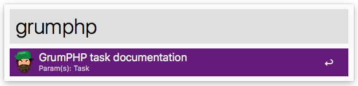

# JCID\GrumPHP

An Alfred workflow to easily open the GrumPHP task documentation page.

**Note**: You will need the Alfred [Powerpack](https://www.alfredapp.com/powerpack/) to use this workflow - which is commercial software. Check out the [Alfred app](https://www.alfredapp.com/) website.

## Usage

The keyword to trigger the search in Alfred is `grumphp` by default.

### Examples

|Search|Alfred opens|
| ------------- | ------------- |
|`grumphp phpcsfixer2`|[GrumPHP PHP-CS-Fixer 2 task documentation](https://github.com/phpro/grumphp/blob/master/doc/tasks/phpcsfixer2.md)|
|`grumphp phpmd`|[GrumPHP PhpMd task documentation](https://github.com/phpro/grumphp/blob/master/doc/tasks/phpmd.md)|
|`grumphp securitychecker`|[GrumPHP Security Checker task documentation](https://github.com/phpro/grumphp/blob/master/doc/tasks/securitychecker.md)|

**Note**: Spaces will be converted to underscores `_`.

## Download

Download the Alfred workflow via the URL

- http://alfred-workflow.jcid.nl/grumphp

## License

This is licensed under [MIT License](LICENSE).
